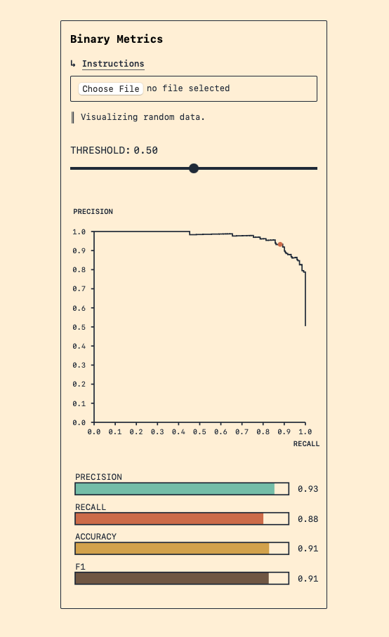

# binary metrics

Hi! This svelte component will visualize the precision-recall curve, and separately the precision, recall, accuracy, and f1-score of a binary classifier _as a function of the classification threshold_. Sliding the threshold slider will update the location on the PR-curve, and the metric bars. Playing with it will give you a visceral sense of how much of each you are trading for the others.

Right now, the project is unlicensed, so you're free to use it for learning and study, but not to build things with it. I'll get round to making it more consumable.

